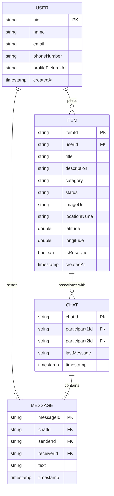

# TraceIt - Lost & Found Application

TraceIt is a modern Android application designed to help users report and find lost or found items. Built with Material 3 design principles, it provides a seamless and user-friendly experience for community-driven item recovery.

## 📋 Table of Contents
- [Project Overview](#project-overview)
- [Features](#features)
- [User Flows](#user-flows)
- [Functional Modules](#functional-modules)
- [Data Architecture (ER Diagram)](#data-architecture-er-diagram)
- [Tech Stack & Dependencies](#tech-stack--dependencies)
- [Project Structure](#project-structure)
- [Setup & Build Instructions](#setup--build-instructions)
- [Firebase Configuration](#firebase-configuration)

## Project Overview
- **App Name**: TraceIt
- **Type**: Native Android (Java)
- **Target**: Android 8.0+ (API 26+)
- **UI Theme**: Vibrant Indigo (#4361EE) & Teal (#4CC9F0) using Material 3.
- **Purpose**: Community-driven lost and found platform with location awareness and real-time chat.

## 🚀 Features
- **User Authentication**: Secure sign-up and login using Firebase Authentication (Email/Password & Google Sign-In).
- **Report Items**: Easily post lost or found items with photos, descriptions, categories, and locations (GPS).
- **Real-time Discovery**: Browse items in a dynamic staggered grid with real-time filtering and search.
- **Real-time Chat**: Connect directly with other users via an integrated chat system.
- **Interactive UI**: Modern Material 3 interface with smooth animations and responsive layouts.
- **Profile Management**: Manage your posts, track active/resolved items, and update your profile picture.

## 🛤️ User Flows

### 1. The "I Lost Something" Flow
1.  **Splash & Auth**: User opens the app, sees the splash animation, and logs in.
2.  **Dashboard**: Browses the list to see if their item was already "Found."
3.  **Report**: If not found, clicks the **"+" (Add Post)** button.
4.  **Creation**: Uploads a photo, selects **"I Lost It"**, and uses **GPS Auto-detect** for location.
5.  **Publish**: Submits the post to the global feed.

### 2. The "Communication & Resolution" Flow
1.  **Connection**: A user clicks **"Contact Finder/Owner"** on an item detail page.
2.  **Chat**: Opens a real-time chat to discuss verification and meeting details.
3.  **Resolution**: Once the item is returned, the original poster clicks **"Mark as Resolved"**.
4.  **Archive**: The item moves to the **"Resolved Items"** tab on the user's profile.

## 🛠️ Functional Modules

- **Authentication**: Integrated Firebase Auth with Google Sign-In for one-tap access.
- **Discovery (Dashboard)**: Pinterest-style staggered grid with real-time search and category filtering.
- **Post Interaction**: Dynamic detail pages with collapsing toolbars and context-aware action buttons.
- **Real-time Messaging**: Instant chat synchronization powered by Firestore listeners.

## 📊 Data Architecture (ER Diagram)



## 🛠️ Tech Stack & Dependencies
- **Language**: Java 11
- **UI Framework**: Android Material Components (Material 3), ViewBinding, ConstraintLayout.
- **Backend**: Firebase (Authentication, Firestore, Cloud Storage, Analytics).
- **Location**: Google Play Services Location.
- **Image Loading**: Glide.

## Project Structure
```
TraceIt/
├── app/
│   ├── src/main/
│   │   ├── java/com/lostandfound/
│   │   │   ├── activities/          # Splash, Login, SignUp, Main, AddPost, ItemDetail, Chat
│   │   │   ├── fragments/           # HomeFragment, MyPostsFragment, ProfileFragment
│   │   │   ├── adapters/            # ItemAdapter, MessageAdapter
│   │   │   ├── models/              # Item, User, Message
│   │   │   └── utils/               # FirebaseHelper, DummyDataUtils, ImageUtils
│   │   ├── res/
│   │   │   ├── layout/              # XML layouts for all screens
│   │   │   ├── drawable/            # Backgrounds, badges, chat bubbles
│   │   │   ├── values/              # strings, colors (vibrant theme), themes
│   │   └── AndroidManifest.xml
│   └── build.gradle
└── README.md
```

## ⚙️ Setup & Build Instructions
1. **Clone the repository**: `git clone https://github.com/Bylerma/Trace-t.git`
2. **Connect Firebase**: Add your `google-services.json` to the `app/` directory.
3. **Configure SHA-1**: Run `./gradlew signingReport` and add your SHA-1 to the Firebase Console.
4. **Update Web Client ID**: Update `default_web_client_id` in `strings.xml`.
5. **Sync & Run**: Sync Gradle and run on an emulator or device (API 26+).

---

**TraceIt** – Helping communities reunite lost items with their owners. 🕵️‍♂️📍
